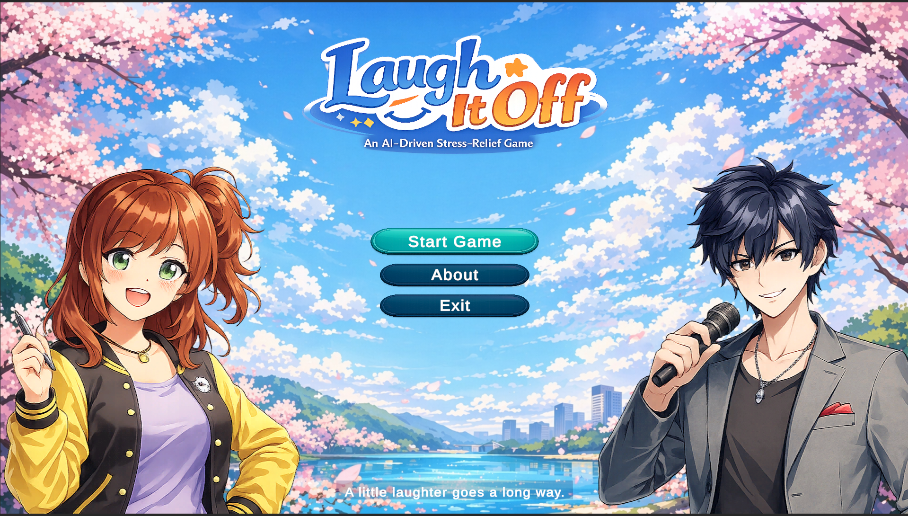
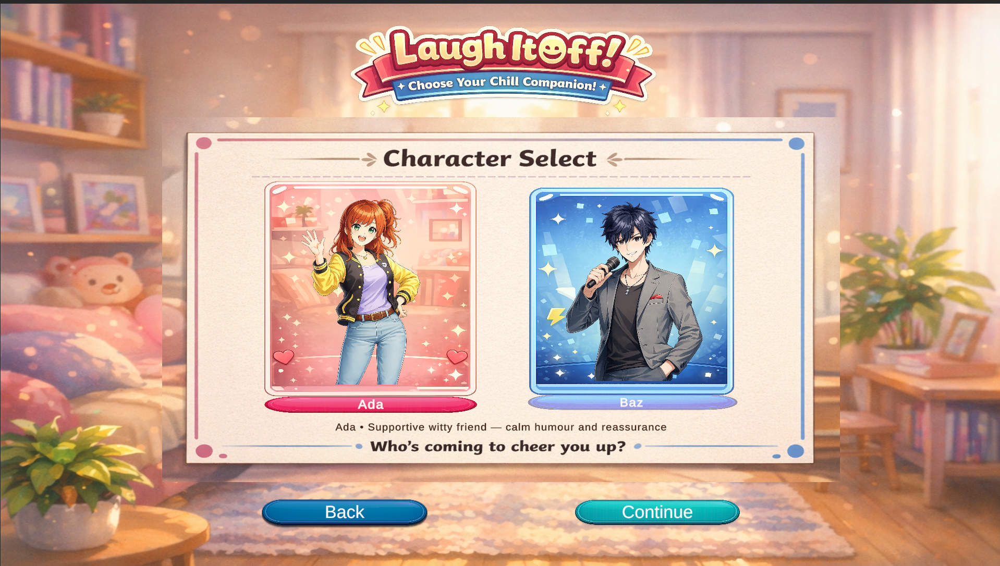
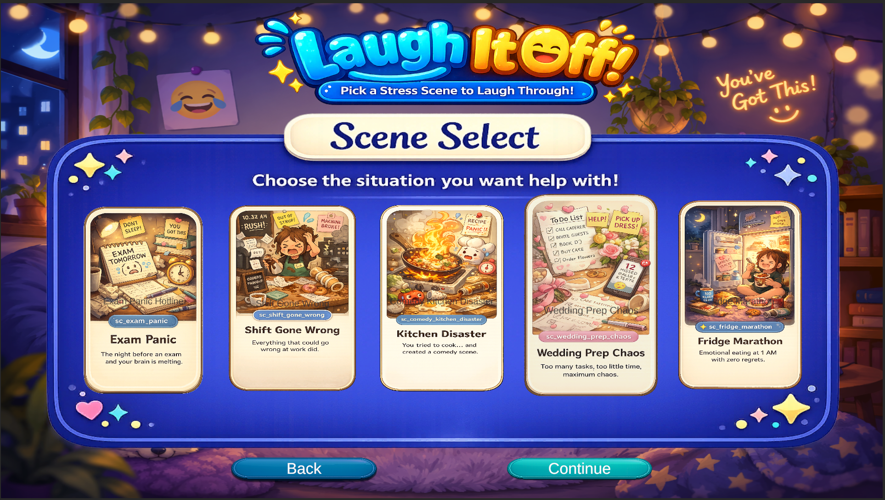
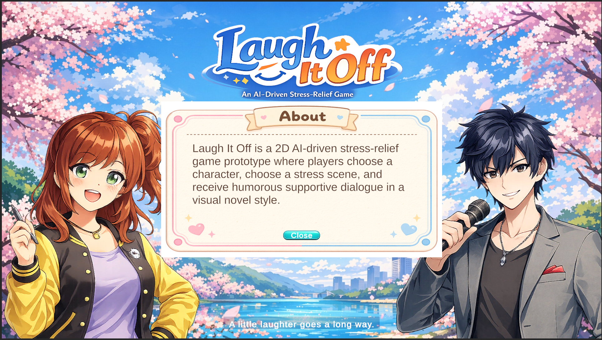
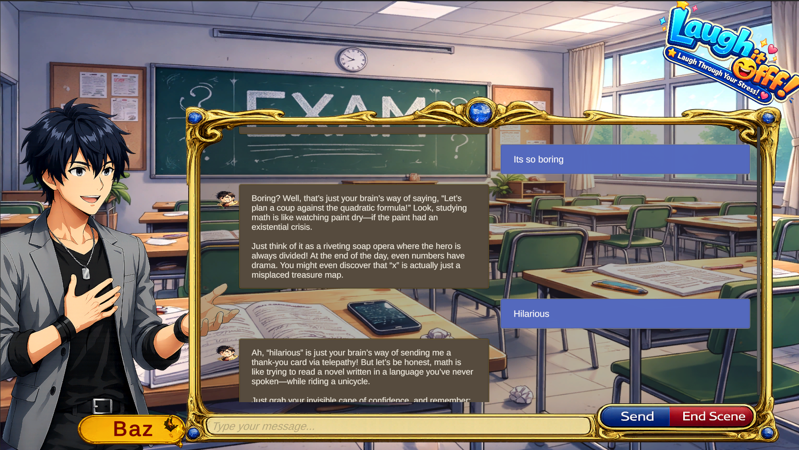
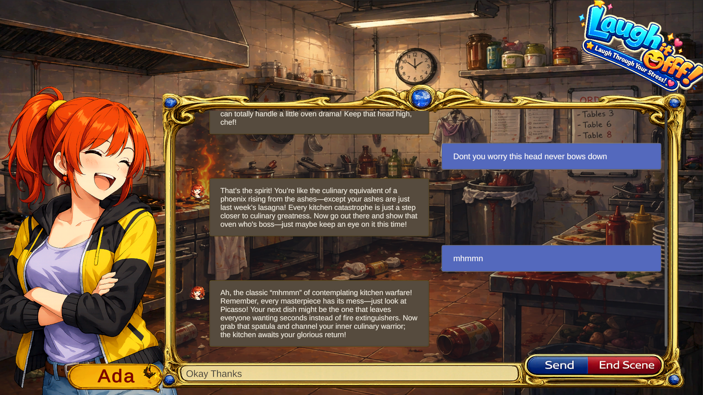
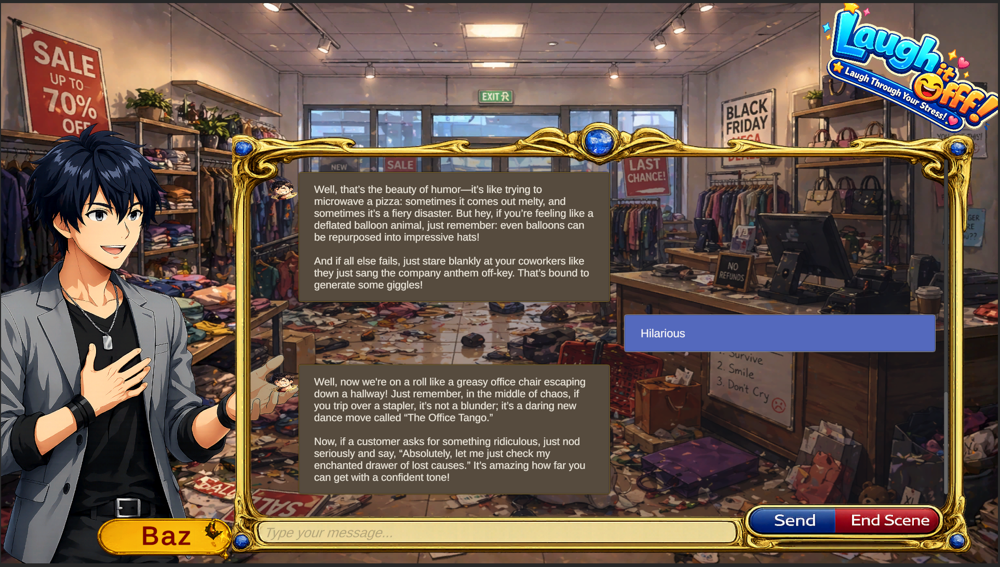
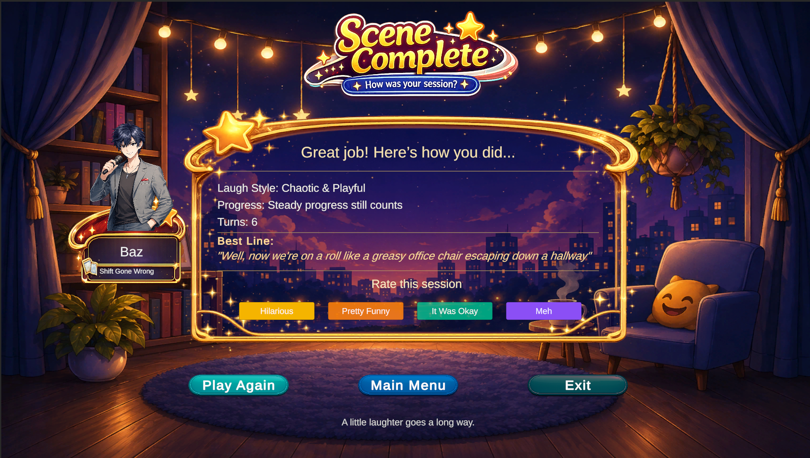
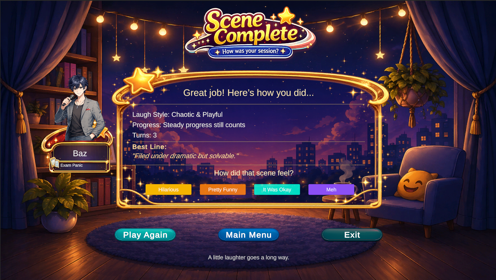

# Laugh It Off – AI-Powered Comedy Game for Stress Relief

**Laugh It Off** is my final-year Computer Science project. It is an AI-powered interactive comedy game designed to support light stress relief through humorous conversations, character-based responses, and mood-aware interaction.

The project was built as a working prototype using a **Unity C# frontend**, a **Python FastAPI backend**, and **LLM API integration**. The system allows users to choose a character, select a scenario, enter a mood rating, chat with an AI comedy character, and receive an end-of-scene summary. 📸 Screenshots are included below to show the main user flow from menu selection to gameplay and end-scene summary.

> This project is designed for entertainment and wellbeing support only. It is not a clinical mental health tool and does not provide medical advice.

---

## Project Overview

Many students experience stress, pressure, and mental fatigue during university life. Traditional wellbeing apps can feel repetitive or generic, so this project explores whether humour and interactive AI conversation can make stress-relief experiences more engaging.

The game uses AI-generated comedy responses to create short, light-hearted interactions based on the selected character, scene, user input, and mood rating.

---

## Main Features

- Character selection with different comedy personalities
- Scene selection based on relatable stressful situations
- Mood check-in before gameplay
- AI-generated comedy responses
- Unity-based chat interface
- Python FastAPI backend
- JSON request and response structure
- Session-based conversation history
- Safety-aware response handling
- Fallback replies if the AI service is unavailable
- End-of-scene summary with mood-after rating
- Session logging for testing and evaluation

---

## Characters

### Ada
Ada is supportive, witty, and gently humorous. Her responses are designed to feel friendly and reassuring while still being funny.

### Baz
Baz is more chaotic and exaggerated. His responses use playful overreaction and silly humour to create a more energetic comedy style.

---

## Example Scenes

The prototype includes comedy scenarios based on everyday stress situations, such as:

- Exam stress
- Work shift chaos
- Fridge disaster
- Wedding preparation chaos
- Comedy kitchen scenario

---

## Screenshots

### Main Menu


### Character Selection


### Scene Selection


### About / Project Information


### Gameplay






### End Scene Summary




---

## Tech Stack

| Area | Technology |
|---|---|
| Game frontend | Unity |
| Programming language | C# |
| Backend API | Python FastAPI |
| AI integration | LLM API |
| Data format | JSON |
| Logging | JSONL session logs |
| UI | Unity UI, TextMeshPro, ScrollRect |
| Testing | Manual functional testing, API testing, gameplay testing |

---

## System Architecture

The project uses a client-server architecture.

The Unity game acts as the frontend. It collects the selected character, scene, mood rating, and user message. This data is sent to the FastAPI backend. The backend builds the AI prompt, sends the request to the LLM service, handles the response, applies fallback logic if needed, and returns the reply to Unity.

This design was chosen because it keeps API keys and prompt-handling logic out of the Unity client.

```text
Unity Game Client
      |
      | JSON Request
      v
FastAPI Backend
      |
      | Prompt + User Context
      v
LLM API
      |
      | AI Comedy Response
      v
FastAPI Backend
      |
      | JSON Response
      v
Unity Chat Interface
